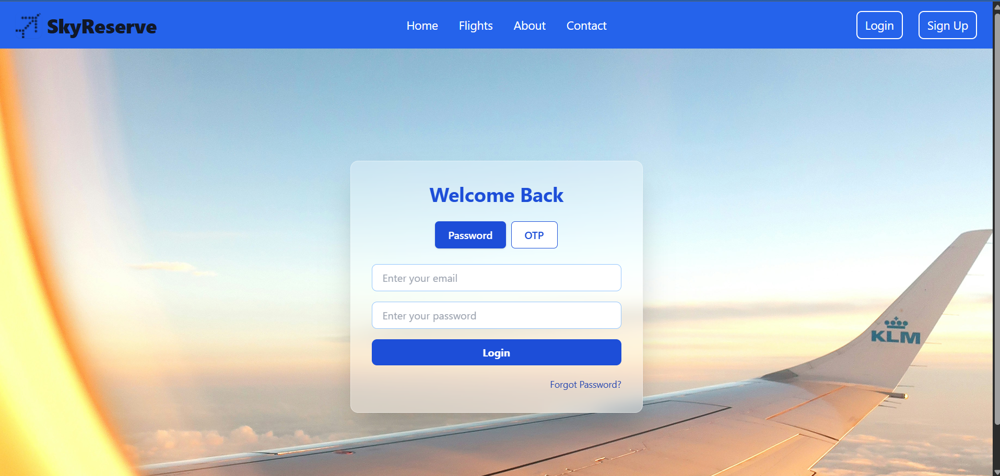

✈️ Sky Reserve – Flight Booking Web App
Sky Reserve is a full-stack flight booking platform where users can search for flights, make bookings, and pay securely. Admins can manage flights and monitor bookings. The application is built using the MERN stack with integrated OTP login, secure payments, and invoice generation.

🚀 Live: https://sky-reserve-6th9.vercel.app

---

🛠 Tech Stack
Frontend
React.js

Redux Toolkit (state management)

Tailwind CSS

Axios

Backend
Node.js + Express.js

MongoDB + Mongoose

Nodemailer (email-based OTP)

Payment Integration (e.g., Razorpay or Stripe)

JWT Authentication

--

## ⚙️ Features

### ✅ User
- Signup / Login
- OTP-based 2FA login via email

### ✈️ Flights
- Create & manage flights (Admin)
- View all flights
- Real-time seat availability
- delete a flight

### 🧾 Booking
- Book flights
- View user-specific bookings

### 💳 Payments
- Razorpay payment integration
- Payment verification
- Automatic invoice generation (PDF)

### 📈 Admin Dashboard
- Total bookings 
- Total flights 
- stats - Occupancy analytics , users, revenue
- His profile details 

### 📈 student Dashboard
- His profile details 
- His bookings list ,
- cancel a booking ,
- download the invoice of bookings 

## 🔐 Environment Variables (.env)

 📬 API Endpoints

| Method | Route | Description |
|--------|-------|-------------|
| `POST` | /api/v1/auth/register | Register user |
| `POST` | /api/v1/auth/login | Login user |
| `POST` | /api/v1/auth/send-otp | Send OTP |
| `POST` | /api/v1/auth/login-otp | Login with OTP |
| `GET`  | /api/v1/flights | Get all flights |
| `POST` | /api/v1/flights | Create flight (Admin) |
| `POST` | /api/v1/bookings | Book a flight |
| `POST` | /api/v1/payment/capture | Create Razorpay order |
| `POST` | /api/v1/payment/verify | Verify payment |
| `GET`  | /api/v1/invoice/:bookingId | Generate PDF invoice |
| `GET`  | /api/v1/admin/stats | Admin dashboard stats |

📬 Contact
Made with 💙 by Shubham Giri
🔗 LinkedIn
📧 ankushgiri2007@gmail.com

